# Virtual desktops (virtual classroom)

A virtual desktop is a virtualized computing environment with a graphical user interface (GUI) easily accessible through a web browser. A group of students can use preconfigured virtual desktops (virtual classroom) in a similar way as a physical classroom but with more flexibility as it can be accessed from home and at any time. High-performance server infrastructure hosting virtual classrooms can provide better computing capabilities for highly demanding simulation software.
  
## Access
Virtual desktops as part of HPC offering are available through Waldur resourse reservation portal: [https://nohap.hpc-net.lv/](https://nohap.hpc-net.lv)  
Please start by clicking on [Sign in with RTU HPC]
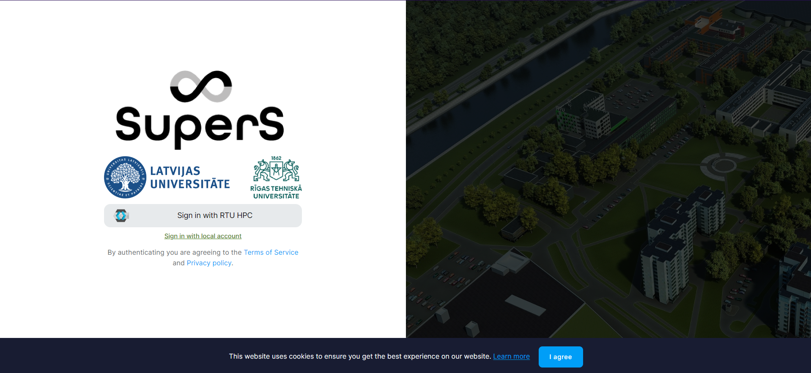
  
By selecting MyAccessID method, you should be able to authenticate with your university login details or eEIDAS.
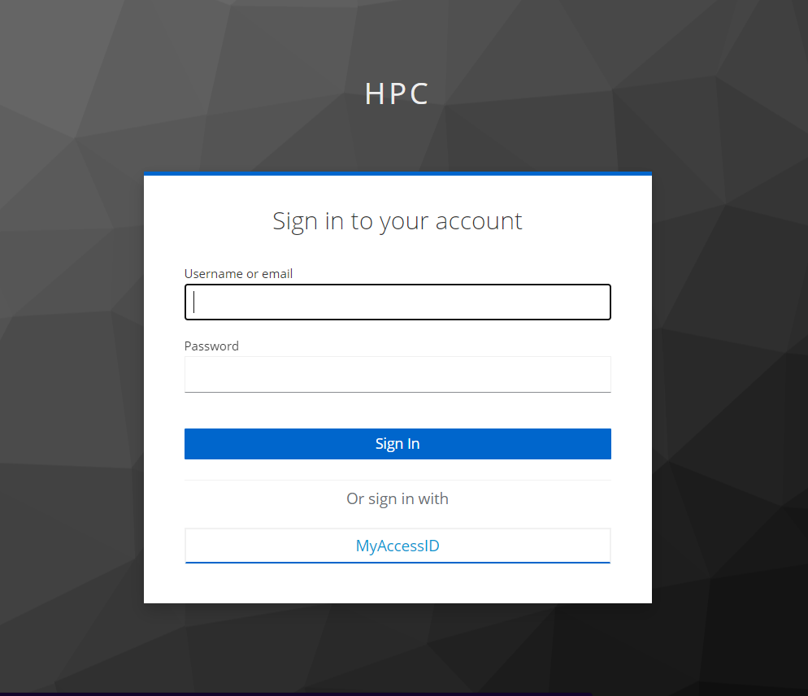
  
In MyAccessID window under "Login with" search for your university's identity provider.  
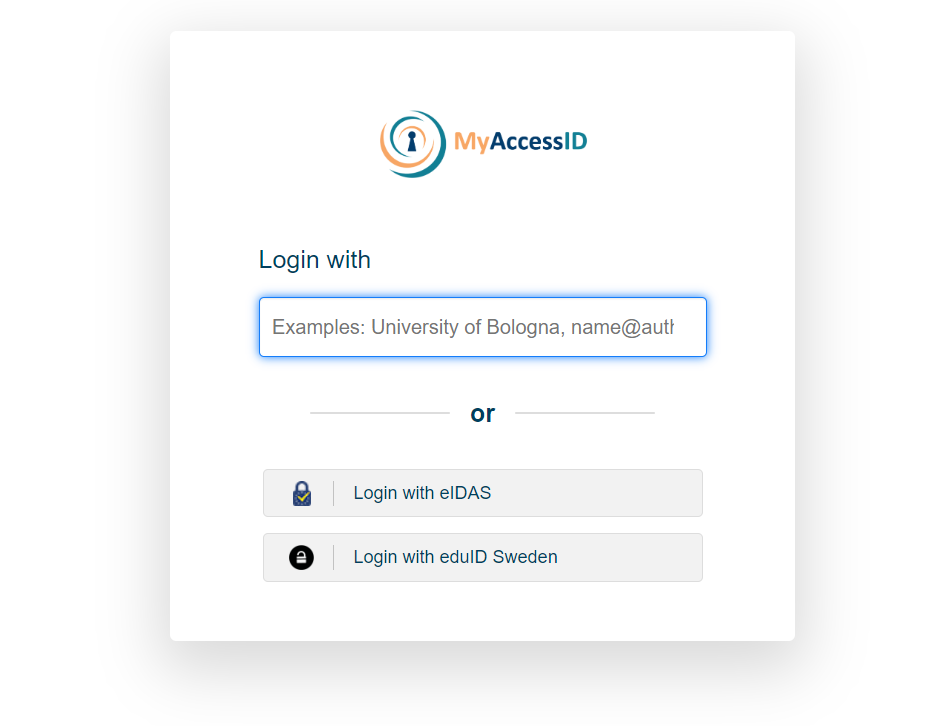
  
In case of the Riga Technical University, select identity provider "Riga Technical University (Office 365)".
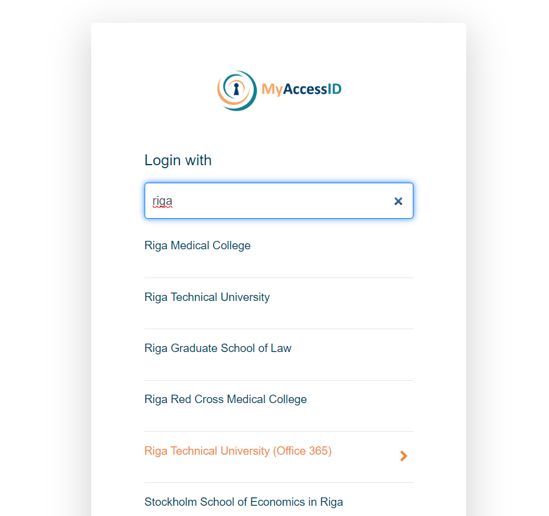

Similar to University of Latvia  
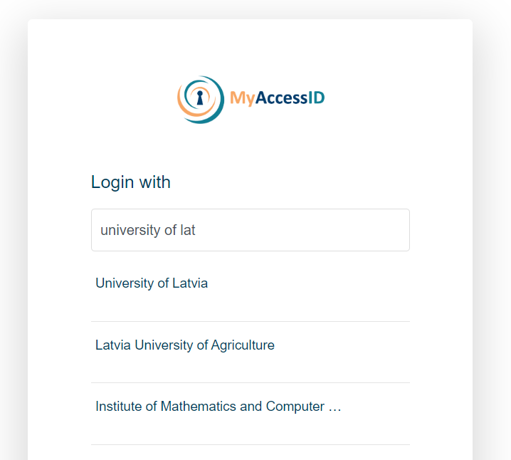

and Riga Stradiņš University  
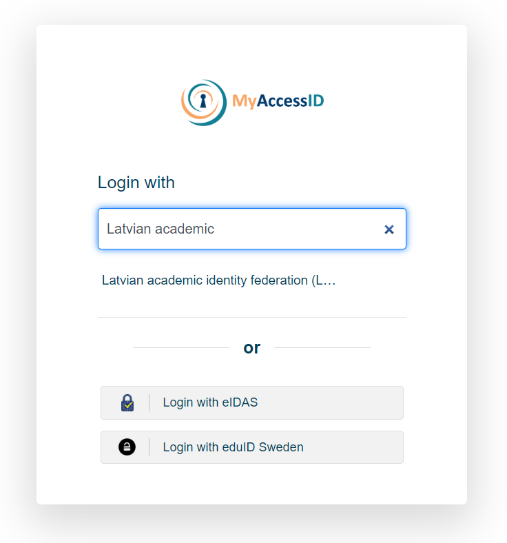

You will be redirected to your organizations identity provider authorization portal, in this case RTU ORTUS.  Please follow all authentication steps begining with your login:
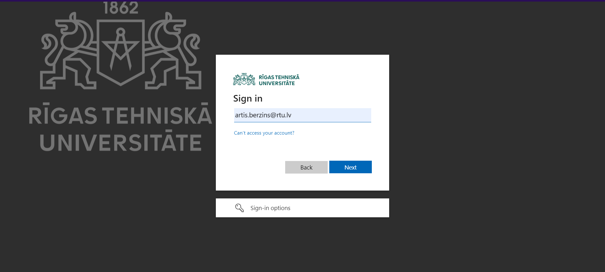
  
Later confirm authentication by scrolling down MyaccessID warning message:

  
After successful authentication you will be asked to confirm[ACCEPT] you name and email in Waldur system profile:
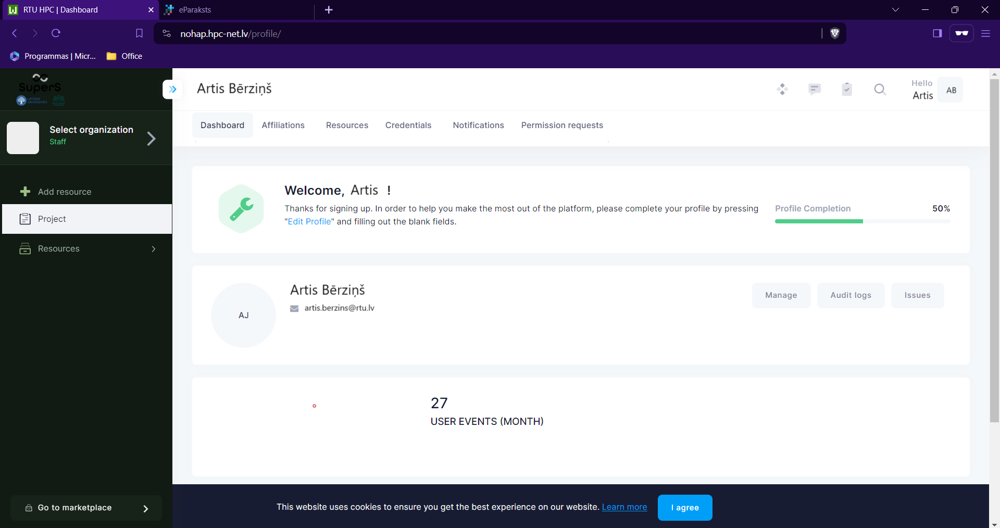

## Invite members to project
In order to invite paricipants to the Project you must have at least Manager role in this Project.  

Follow these steps to get to invitation form:
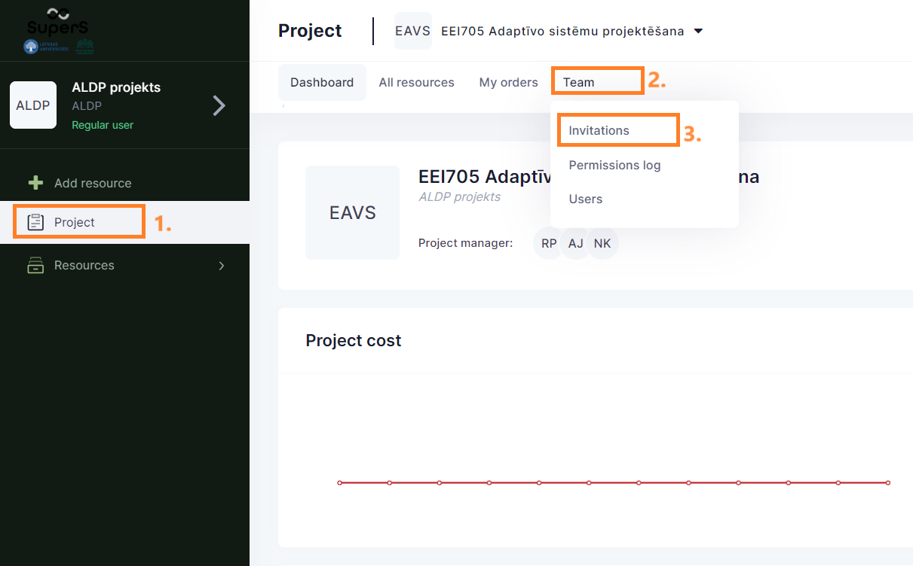  

Then fill invitation form with members' email address[4.] and propper role[5.] in project - "member" in this case.  
With + button you can add additional participants to this invitation session.  
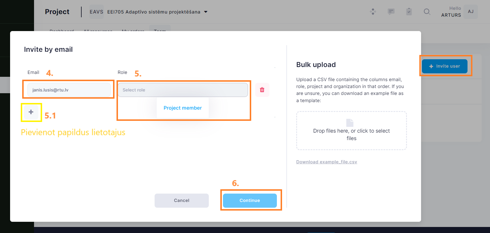  

Last activity is to add custom message to invitation email, then submit[9.] to finish invitation procedure. 
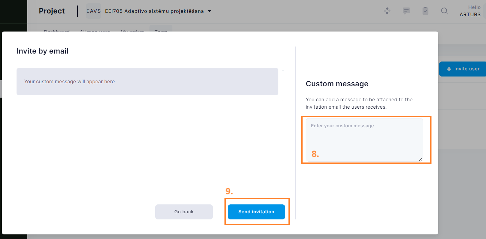

  
## Requesting a Virtual destkop (demonstration)

The following videos are in Latvian.

<iframe src="https://slides.com/viktorszagorskis-1/rtu-hpc/embed?share=hidden" width="576" height="420" title="RTU HPC" scrolling="no" frameborder="0" webkitallowfullscreen mozallowfullscreen allowfullscreen></iframe>
