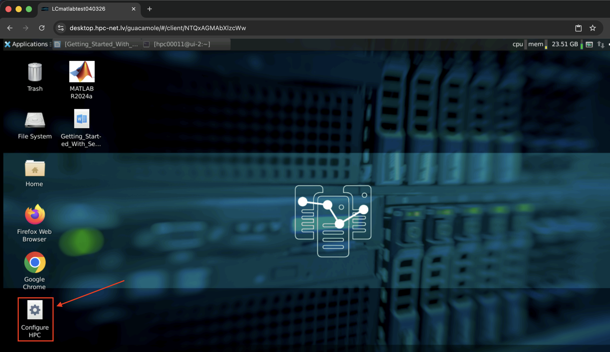
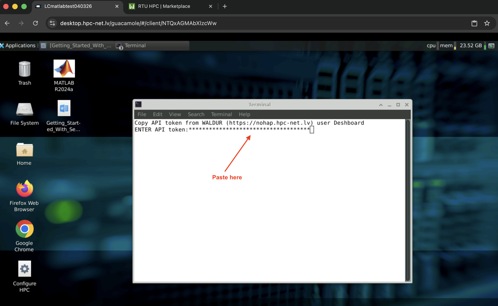
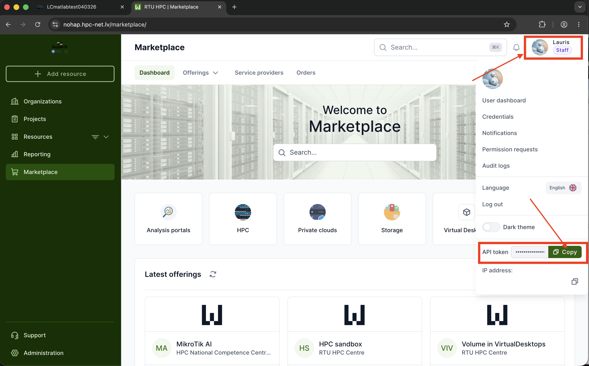
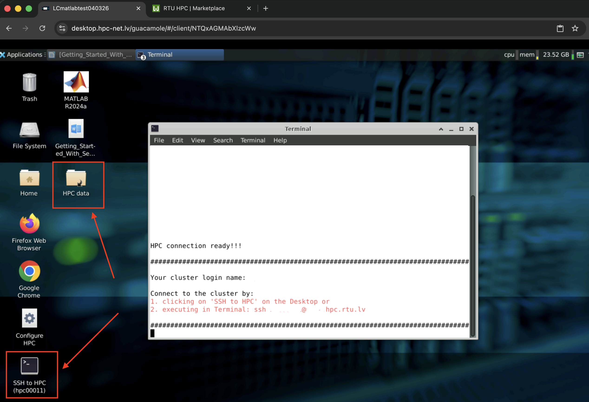

# Virtual desktops

A virtual desktop is a virtualized computing environment with a graphical user interface (GUI) easily accessible through a web browser. A group of students can use preconfigured virtual desktops (virtual classroom) in a similar way as a physical classroom but with more flexibility as it can be accessed from home and at any time. High-performance server infrastructure hosting virtual classrooms can provide better computing capabilities for highly demanding simulation software.
  
## Access
Virtual desktops as part of HPC offering are available through Waldur resourse reservation portal: [https://nohap.hpc-net.lv/](https://nohap.hpc-net.lv)  

```{include} ./include/waldur_access.md
```

## Invite members to project

```{include} ./include/waldur_invite.md
```

## Requesting a Virtual destkop

```{include} ./include/waldur_market_vd.md
```

## Requesting a Virtual destkop (demonstration)

The following videos are in Latvian.

<iframe src="https://slides.com/viktorszagorskis-1/rtu-hpc/embed?share=hidden" width="576" height="420" title="RTU HPC" scrolling="no" frameborder="0" webkitallowfullscreen mozallowfullscreen allowfullscreen></iframe>


---
##
## Configure HPC connection from the virtual desktop

Once your virtual desktop is running, you can connect it to the HPC cluster
(supercomputer) with a single click. The **Configure HPC** helper is preinstalled
on every virtual desktop image and takes care of:

- generating an SSH key pair on the virtual desktop and uploading the public
  key to your Waldur account so the cluster recognises you,
- discovering your cluster login name from your active allocation,
- mounting your HPC home directory on the desktop as the **HPC data** folder, and
- placing a one-click **SSH to HPC** launcher on the desktop.

You only need to run it once per virtual desktop. Re-run it any time you rotate
your Waldur API token or your HPC access is reset.

### Before you start

- You are signed in to the virtual desktop through the browser
  ([https://desktop.hpc-net.lv](https://desktop.hpc-net.lv)).
- You can sign in to Waldur at [https://nohap.hpc-net.lv](https://nohap.hpc-net.lv)
  with the same identity you used to deploy the virtual desktop.
- **You have an active HPC allocation.** Configure HPC does *not* create an HPC
  account for you — it only configures this virtual desktop to use one that
  already exists. Your Waldur project must already contain an active
  *RTU HPC (RUDENS)* allocation; if it does not, request one first as described
  in
  [Request HPC resource (allocation)](https://hpc-platforma.rtu.lv/hpc.html#request-hpc-resource-allocation).
  Running Configure HPC without an allocation will fail with an error.

### Steps

1. On the virtual desktop, locate the **Configure HPC** icon on the left side
   of the desktop and double-click it.

   

   > **Note:** If there is no **Configure HPC** icon on the desktop, then the
   > virtual desktop template you selected does not support autoconfiguration.
   > Either redeploy the virtual desktop from a template that supports it
   > (see
   > [To deploy pre-configured virtual machine with remote desktop access](#to-deploy-pre-configured-virtual-machine-with-remote-desktop-access))
   > or follow the manual [SSH access](https://hpc-platforma.rtu.lv/hpc.html#ssh-access)
   > steps instead.

2. A terminal window opens and prompts you for your Waldur **API token**:

    ```
    Copy API token from WALDUR (https://nohap.hpc-net.lv) user Dashboard
    ENTER API token:
    ```

   

3. Leave that terminal open and switch to a browser tab with Waldur
   ([https://nohap.hpc-net.lv](https://nohap.hpc-net.lv)). Click your
   **profile picture** in the top-right corner, then click the **Copy** button
   next to *API token*. The token is now in your clipboard.

   

   > **Note:** Treat the API token like a password — anyone with this token
   > can act on your behalf in Waldur. If you suspect it has leaked, regenerate
   > it from the same dashboard and re-run **Configure HPC**.

4. Return to the virtual desktop, click inside the terminal, paste the token
   (Ctrl + Shift + V in the desktop terminal, or right-click → *Paste*) and
   press **Enter**.

5. The script runs for a few seconds. When it finishes you will see a
   confirmation similar to:

    ```
    HPC connection ready!!!
    ##############################
    Your cluster login name: hpcXXXX
    Connect to the cluster by:
      1. Clicking on 'SSH to HPC' on the Desktop, or
      2. executing in Terminal: ssh hpcXXXX@xx.hpc.rtu.lv
    ```

   

### After running

Two new items appear on your desktop:

- **HPC data** — a shortcut to your home directory on the cluster. Open it in
  the file manager to browse, drag-and-drop, and edit files on the HPC
  directly from the virtual desktop.
- **SSH to HPC (hpcXXXX)** — a one-click launcher that opens a terminal
  already logged in to the cluster as your user. The number in parentheses is
  your personal cluster login name.

You can also connect from any terminal on the virtual desktop with:

```bash
ssh <your-login>@xx.hpc.rtu.lv
```

No password is required — the SSH key generated by **Configure HPC** is used
automatically.

### Using Configure HPC on your own machine

The steps above apply to virtual desktops where **Configure HPC** is already
preinstalled. If you would like to deploy and run the same helper on your own
workstation (Linux or macOS), the source code and installation instructions
are available in the project repository:

[https://github.com/rtuhpc/configureHPC](https://github.com/rtuhpc/configureHPC)

The prerequisites (active *RTU HPC (RUDENS)* allocation and a valid Waldur
API token) and the resulting behaviour are the same as described above.

### Troubleshooting

- *No active HPC allocation found / allocation error* — your Waldur project
  does not yet have an active *RTU HPC (RUDENS)* allocation, so the script
  has nothing to configure against. Request an allocation as described in
  [Request HPC resource (allocation)](https://hpc-platforma.rtu.lv/hpc.html#request-hpc-resource-allocation),
  wait for it to be approved, then re-run **Configure HPC**.
- *"Invalid API token"* — the value pasted into the terminal is missing
  characters or has been regenerated in Waldur. Copy the token again from
  the Waldur user dashboard and re-run **Configure HPC**.
- *"Connection refused" / "Permission denied" when using `ssh`* — make sure
  **Configure HPC** has been run on this specific virtual desktop. Each
  virtual desktop has its own SSH key, so a desktop redeployed from scratch
  needs to run the helper again. Also note that after Configure HPC uploads
  the key to Waldur it can take a few minutes for the cluster to pick it up.
- *No **HPC data** or **SSH to HPC** icons on the desktop* — the script did
  not finish successfully. Re-run **Configure HPC** and watch the terminal
  output for error messages.
