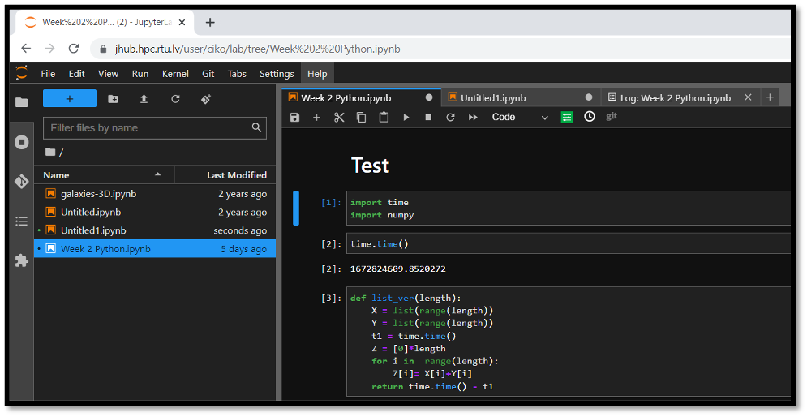
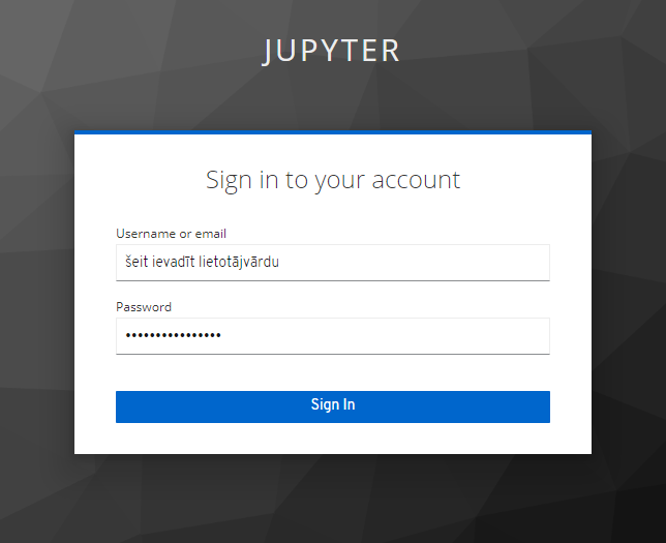
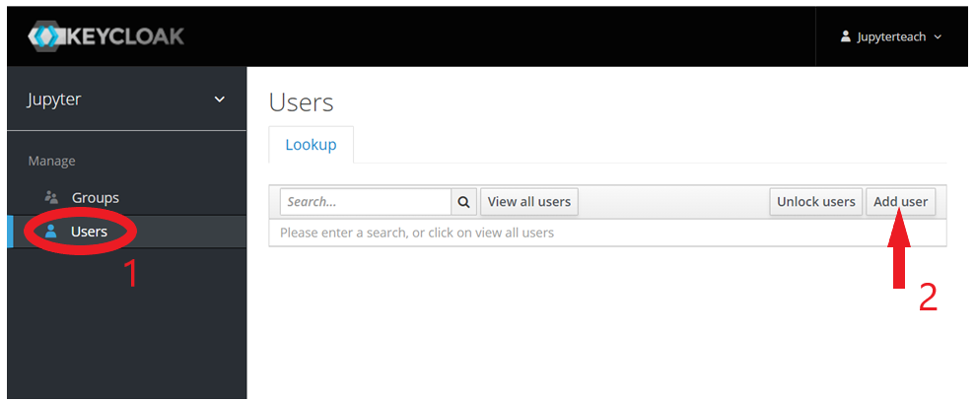
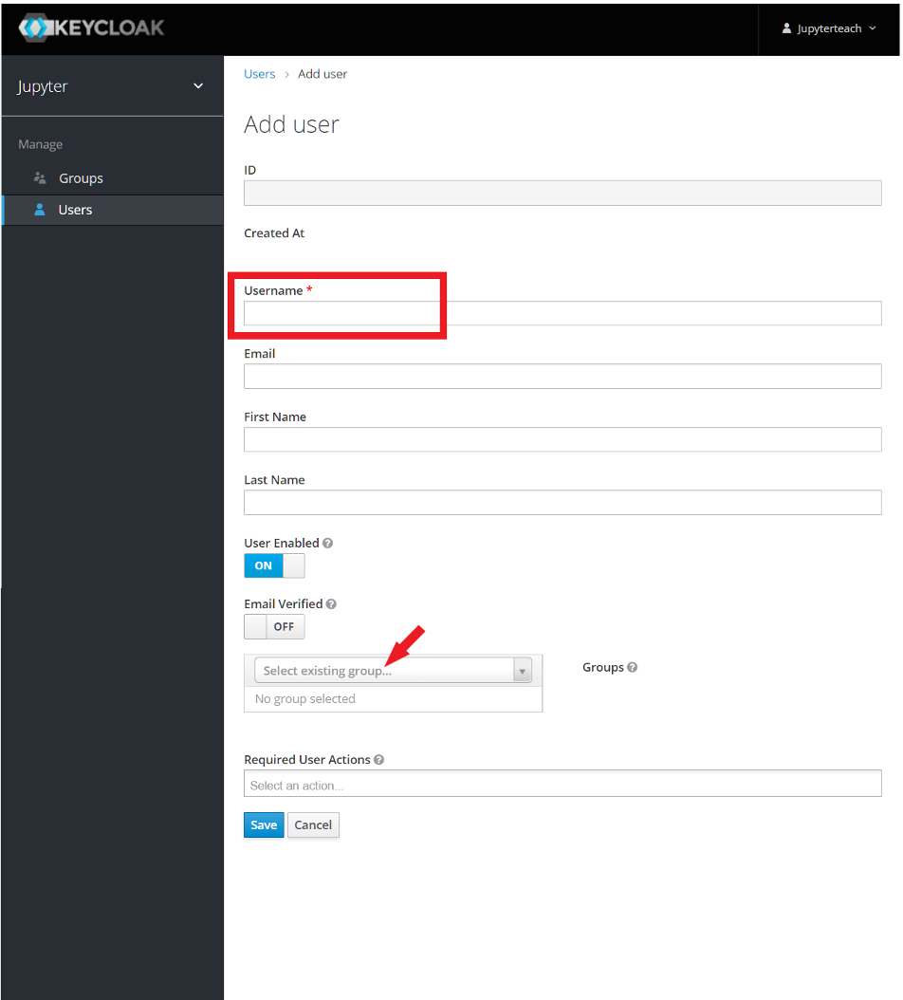
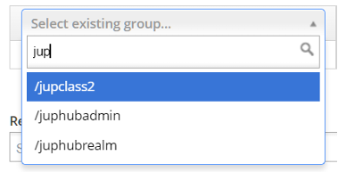
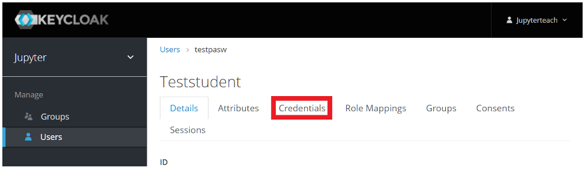
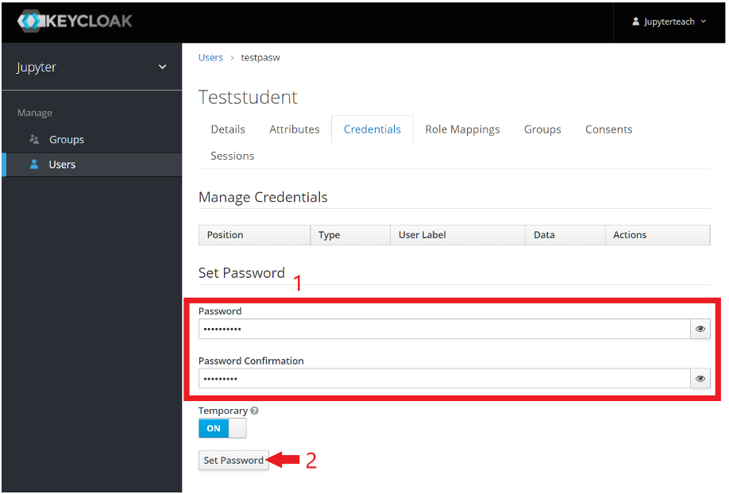

# Jupyter Hub

RTU HPC Jupyter Hub: [https://jhub.hpc.rtu.lv/](https://jhub.hpc.rtu.lv/)

Access to the Jupyther Hub can be requested through the RTU HPC center: [Registration form](https://docs.google.com/forms/d/e/1FAIpQLSdsEhMkfAGtDyS6z6yYo0mDf1PQRxC06fxPI2D7YVzvDrwa-g/viewform?c=0&w=1).

JupyterHub is an open-source graphical programming environment accessible through a web interface. Currently, programming in Python and R languages is supported on the RTU Jupyter environment. The prepared tasks can be run on a single 32 vCPU and 64GB RAM virtual machine, but in the future, it is planned to create the possibility of running tasks on GPUs and the whole cluster. [More information https://hpc.rtu.lv/jupyterhub/](https://hpc.rtu.lv/jupyterhub/).

## Register group of students

You must have an instructor account to register and invite group of students.

Follow the address: [https://jhub-auth.hpc.rtu.lv/auth/admin/jupyter/console](https://jhub-auth.hpc.rtu.lv/auth/admin/jupyter/console).

Enter your username and password.

On the left side click on the button "Users" and then on the right side on "Add user".

Enther the student's username in the field "Username" and in the box "Select existing group" enter the name of the desired classroom to which you wish to add the student.

Lastly, click on "Save" and scroll to the top of the page.

Click on “Credentials”. 

Enther the password that the student will use to log in in the fields “Password” and “Password Confirmation” and click on "Set password"

That is it! A new student has been registered to your classroom.
