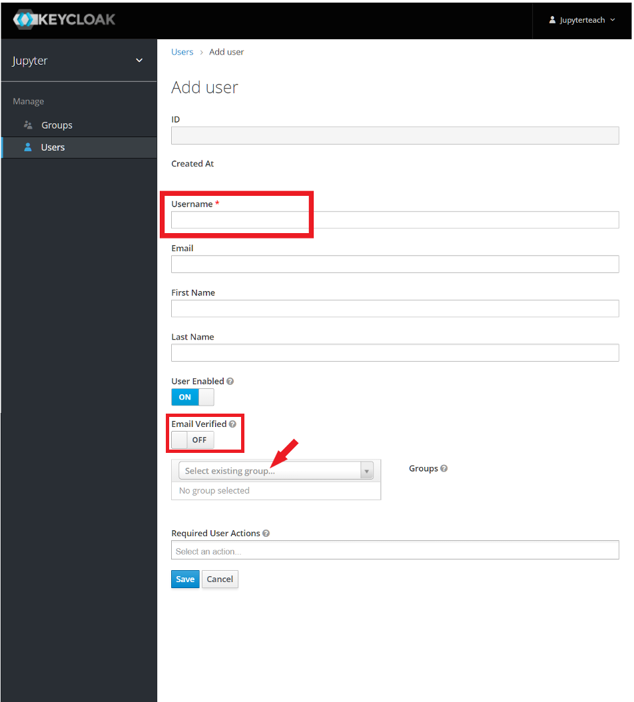

# Jupyter Hub

RTU HPC Jupyter Hub: [https://jhub.hpc.rtu.lv/](https://jhub.hpc.rtu.lv/)

Access to the Jupyther Hub can be requested through the RTU HPC center: [https://hpc.rtu.lv/jupyterhub/](https://hpc.rtu.lv/jupyterhub/)

## Register a group of students

You must have an instructor account to register and invite group of students.

Follow the address: [https://jhub-auth.hpc.rtu.lv/auth/admin/jupyter/console(https://jhub-auth.hpc.rtu.lv/auth/admin/jupyter/console).

Ievadīt lietotājvārdu un paroli.

Kreisajā pusē jānoklikšķina uz pogas “Users” un tad, labajā pusē, uz “Add user”.

Jāievada laukā “Username” studenta lietotājvārds un laukā “Select existing group”, jāievada klases nosaukums.

Beigās jānospiež poga “Save” un jāaiziet uz lapas augšu

Lapas augšā jānospiež poga “Credentials”. 

Jāievada tikko piereģistrētā studenta parole laukos “Password” un “Password Confirmation” un jānospiež set password

Jauna studenta piereģistrēšana JupyterHub videi ir pabeigta!
