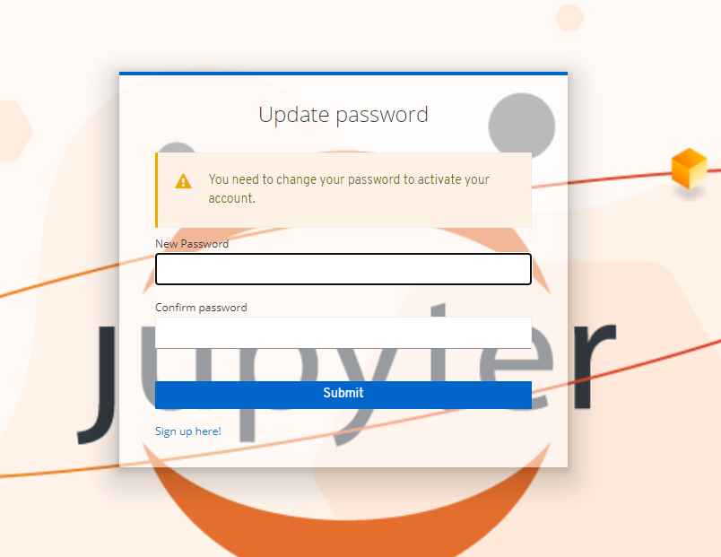

# Jupyter Hub
JupyterHub is an open-source graphical programming environment accessible through a web interface. Currently, programming in Python and R languages is supported on the RTU Jupyter environment. The prepared tasks can be run on a single 32 vCPU and 64GB RAM virtual machine, but in the future, it is planned to create the possibility of running tasks on GPUs and the whole cluster. [More information https://hpc.rtu.lv/jupyterhub/](https://hpc.rtu.lv/jupyterhub/).

## Access
**RTU HPC Jupyter Hub portal:** [**https://jhub.hpc.rtu.lv/**](https://jhub.hpc.rtu.lv/)

Access to the Jupyther Hub should be requested through the RTU HPC center [registration form](https://docs.google.com/forms/d/e/1FAIpQLSdsEhMkfAGtDyS6z6yYo0mDf1PQRxC06fxPI2D7YVzvDrwa-g/viewform?c=0&w=1).  
Only the university employees (researchers, instructors, administration) may request access. 
Students are invited by their course instructors (see the procedure [in the next section](https://hpc-platforma.rtu.lv/02_jupyter_hub.html#register-group-of-students)). 

### Login to Jupyter Hub

To login in jupyter first go to [**https://jhub.hpc.rtu.lv/**](https://jhub.hpc.rtu.lv/)

Then enter your username and password

If this window appears, enter a new password for your user.

## Register group of students

You must have an instructor account to register and invite group of students.

Follow the address: [https://jhub-auth.hpc.rtu.lv/auth/admin/jupyter/console](https://jhub-auth.hpc.rtu.lv/auth/admin/jupyter/console).

Enter your username and password.

On the left side click on the button "Users" and then on the right side on "Add user".

Enther the student's username in the field "Username" [**it is advisable to not use an email address as a student's username, thiss may cause errors**], verify that the email verified box is set to **ON** and in the box "Select existing group" enter the name of the desired classroom to which you wish to add the student.

Lastly, click on "Save" and scroll to the top of the page.

Click on “Credentials”. 

Enther the password that the student will use to log in in the fields “Password” and “Password Confirmation” [**advisable to use the same password for all students**]and click on "Set password"

That is it! A new student has been registered to your classroom. **The student does not receive his login details automatically**, you need to give the student his username and password manually.

Login to jupyter: [https://jhub.hpc.rtu.lv](https://jhub.hpc.rtu.lv)
