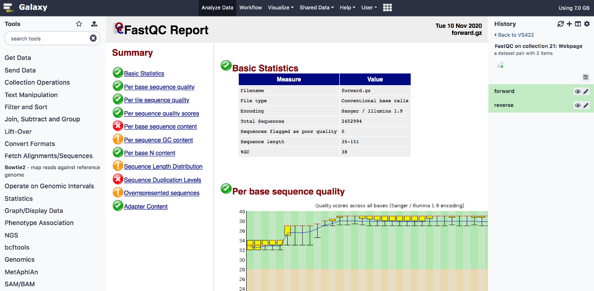

# Galaxy portal
Galaxy is an open platform for supporting data-intensive research with a focus on biomedical data (for example, genome, transcriptome, proteome) analyses. The analyses can be performed using graphical tools and hence could be easily used by non-bioinformaticians. The RTU Galaxy instance is connected to the HPC cluster and serves as a web-based GUI to submit analyses to the cluster.   

The Galaxy interface is shown in the following figure. It is an example output of the sequencing quality control tool FastQC. 

## Access
RTU HPC Galaxy instance is available here: [https://galaxy.hpc.rtu.lv](https://galaxy.hpc.rtu.lv).  

Access to this galaxy can be requested by sending an email to hpc@rtu.lv. You should be able to auto-register also with your RTU HPC cluster credentials. Any requests regarding tools or reference datasets can be sent to support e-mail as well. 

## Galaxy demonstration
