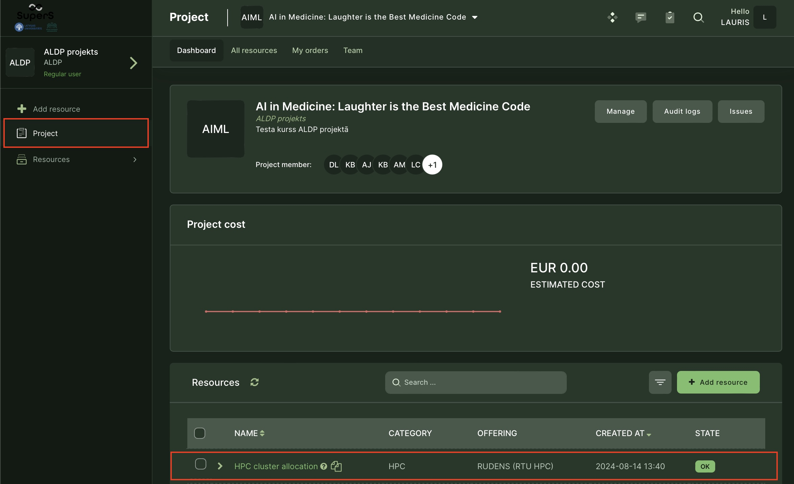
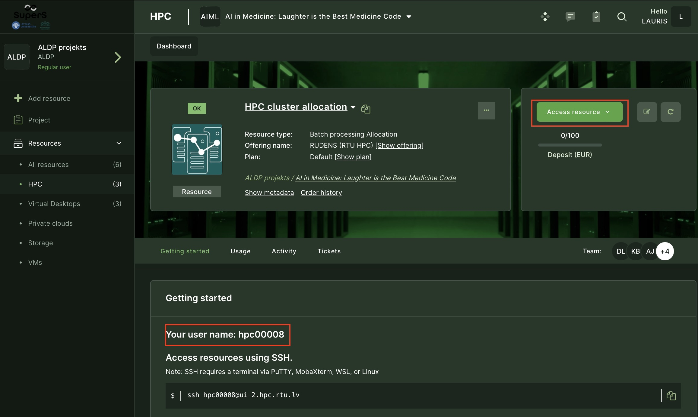
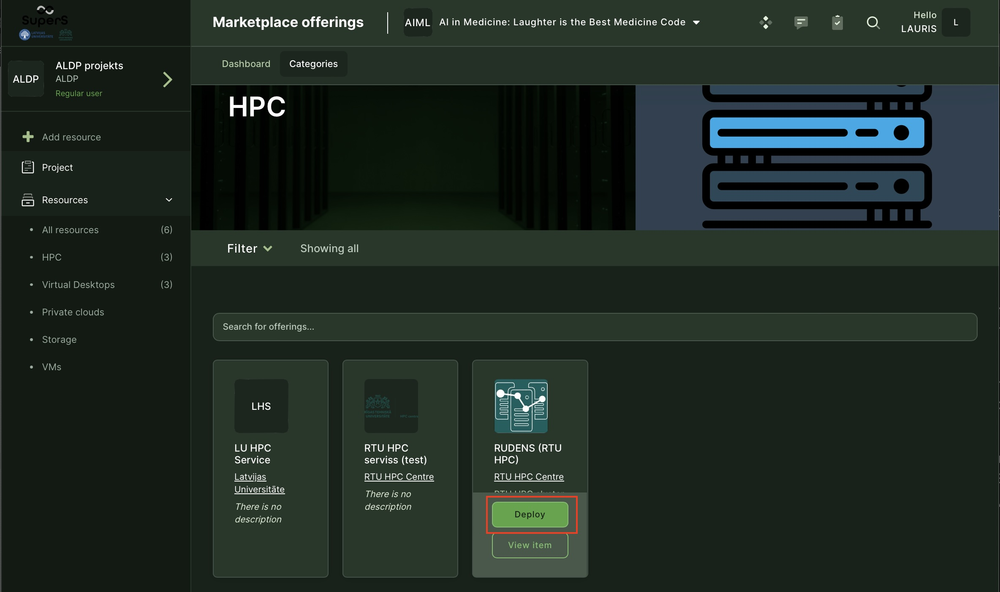
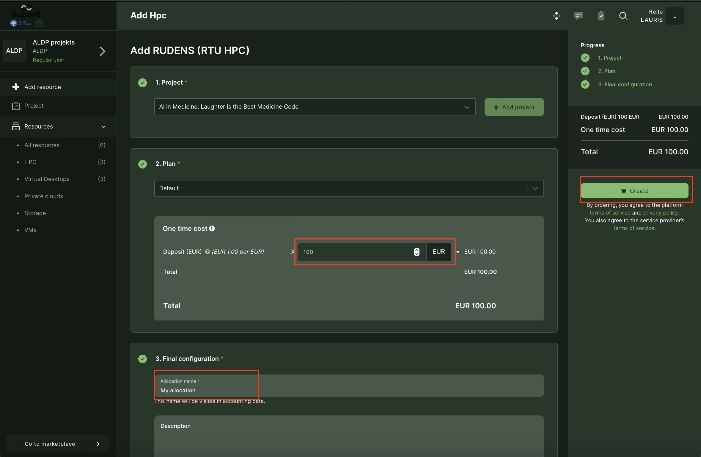
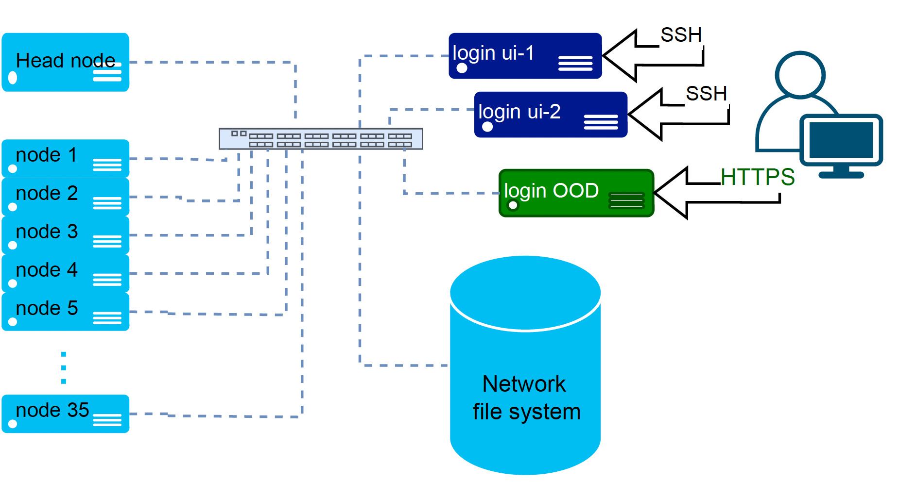
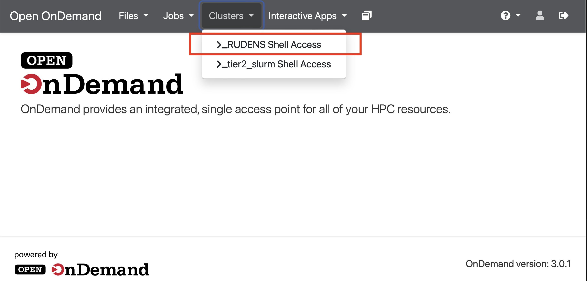
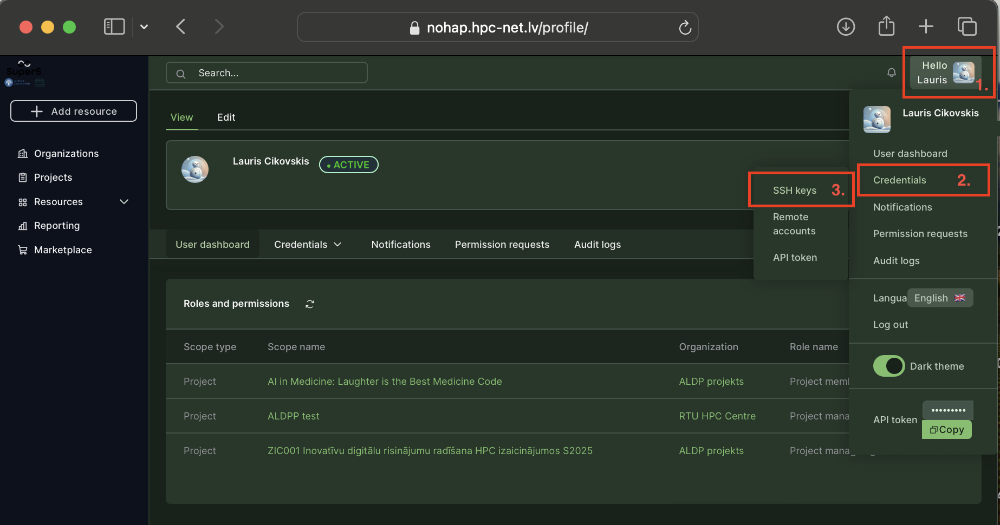
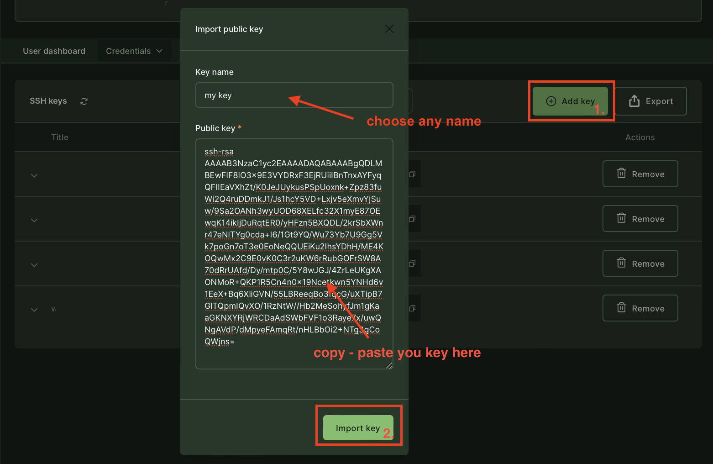
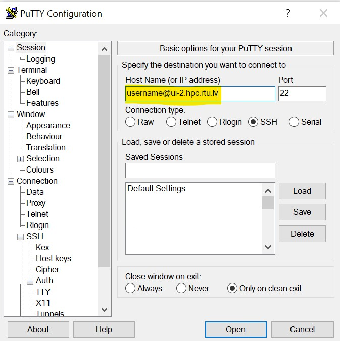

# HPC cluster (supercomputer)

A High-Performance Computing (HPC) cluster consists of several compute nodes interconnected by a fast computer network (e.g., InfiniBand). Compute nodes are individual servers within the cluster that perform computational tasks. HPC clusters can be used for parallel computing, executing a complicated task simultaneously on several compute nodes, and distributed computing, performing smaller independent tasks on separate nodes or processor cores. HPC cluster allows solving complex problems faster and has the ability to tackle larger datasets. Multiple users can work concurrently, each with their own computing tasks and workflows, and within their working directory to store data.

## Apply for HPC
To receive access to the HPC cluster RUDENS
- research groups, course instructors, and individual students working on thesis/research must fill in the [APPLICATION FORM](https://docs.google.com/forms/d/e/1FAIpQLSemd1JlJB2lyW0Fal6OA3MM7cmxpqh0GQt145lrzmqqIFQIeA/viewform).  After receiving the application, the HPC Centre will review it and contact you on the following steps.
- students involved in the study course and need HPC as part of their course curriculum should receive an invitation from their course instructor.

## Get an account on the HPC cluster RUDENS (after approval)

After the application is approved, you will receive an email inviting you to participate in a project in the Waldur self-service portal. You may also receive an email even if you didn't apply for HPC yourself, but your project leader or course instructor has invited you. Note that the invitation will expire in 2 weeks. 

In the portal, you will acquire an account on the HPC cluster.

### Connect to Waldur self-service portal
Follow the link to the National Open HPC Platform: [https://nohap.hpc-net.lv](https://nohap.hpc-net.lv)

```{include} ./include/waldur_access.md
```
### Invite participants

```{include} ./include/waldur_invite.md
```
### Request HPC resource (allocation)
You must belong to a project/study course to perform this step. 

First, check whether your project already has active HPC allocation. Usually, **there should be only one active allocation per project** that all project members can use. Go to `Project` view and check the `Resources` section for the existing "RTU HPC (RUDENS)" resource (alllocation).



Allocation is a certain amount of computing resources (CPU hours, GPU hours, memory) that is allocated for project use, and it is expressed in its price in EUR. Initial credit (EUR) is deposited when HPC service is obtained through the Marketplace. If allocated credit is spent, you may request a new allocation or extend the existing one by depositing additional funds. Note that it is virtual credit that sets resource usage limits; it is not the front payment. Real money is charged only according to actual use and according to an agreement with the HPC center.

To start using the HPC cluster, press on the allocated resource name (in the example, "HPC cluster allocation"). In the resource view, you will get additional information about your username and access details.



**Request new HPC resource**. If your project doesn't have active HPC allocation, you can request it through the marketplace. Press the `Add resource` button and look for RUDENS (RTU HPC) offering. 



By pressing `Deploy,` the form will open where you should specify your deposit (in EURs) and an arbitrary name for the resource. Then press `Create`, and the request will be submitted to the RTU HPC center for review and approval.



## Connect to the HPC cluster

Users access the HPC cluster RUDENS remotely using secure shell (SSH) protocol or HTTPS web-terminal. Work with the cluster occurs via a dedicated server (login node) with the Linux command-line interface and job management tools. The next figure visualize a user connection to the cluster.



### Web-terminal access
Open OnDemand (OOD) portal provides a web-based terminal in your browser. No SSH password or keys are required. It will use the same identity you provided when connected to the Waldur self-service portal. A simple file browser with upload/download functionality is available in OOD.

Go to our OOD ([https://ood.hpc.rtu.lv/](https://ood.hpc.rtu.lv/)) or press `Access resource` button in the self-service portal and look for the Clusters tab. Select `RUDENS Shell_access`.




### SSH access

You need an SSH key to connect to the RUDENS login node. Passwords are not supported for the accounts requested through the self-service portal. Follow the described steps to prepere a SSH key.

#### 1. Generate a SSH key
If you don't have an SSH key, you can generate one using instructions in [our HPC user-guide](https://hpc-guide.rtu.lv/appendix.html#generating-keys-on-windows-using-mobaxterm) (for Windows). If you use Linux or MacOS, open the Terminal app (command line) and simply execute the command:
  ```
   ssh-keygen
   ```
Two files will be generated: private key (default name id_rsa) and public key (id_rsa.pub). Keep the private key secret. For a more detailed explanation of SSH keys, follow the to [SSH Academy](https://www.ssh.com/academy/ssh/keygen).

#### 2. Upload the public key
Before connection, your SSH public key must be uploaded to the Waldur self-service portal. By doing so, your public key will be available for the HPC cluster to recognize you on the SSH connection.
- Go to the top right of the screen and click on your name to open the account menu. 
- Click on the `Credentials` link to open a sub-menu where you can select `SSH keys`.

- Copy contents of your public SSH key.

- **Wait at least 5 minutes** while the key is synchronized to the cluster.

#### 3. Use the key
**On Linux/macOS systems**, if the generated keys are stored in the default directory ~/.ssh/, connect to a cluster by using the `Access resource` button in the self-service portal or manually open the command line (terminal) and run the following command:
   ```
   ssh username@ui-2.hpc.rtu.lv
   ```
If you stored the keys in other location then default (~/.ssh/), additonally specify the path to the private key:
   ```
   ssh -i ./id_rsa username@ui-2.hpc.rtu.lv
   ```
Change 'username' to your actual login name, which you can see in the resource view in Waldur.

**For Windows SSH clients**, such as Putty or MobaXterm, the path to private key file must be specified in the connection settings.
 - For Putty: click `Connection` => `SSH` => `Auth` => `Browse` for the private key
 - For MoabXterm: click `Settings` => `Configuration` => `SSH` tab => in the agent section click on the `+` sign to import your private key

In the Session sectoin specify your username and the login node Host name as shown in the example. We recomend saving the session for future use.

Change 'username' to your actual login name, which you can see in the resource view in Waldur.

**Note: if the login node requests the password during connection, your SSH key is not recognized or configured correctly.**

## Start using the HPC cluster

[Follow the link to the user guide on using the HPC cluster RUDENS.](https://hpc-guide.rtu.lv)

## HPC demo-cases

Reusable examples (with codes) of HPC applications in various scientific domains: [https://gitlab.com/eurocc-latvia](https://gitlab.com/eurocc-latvia).

- Assessment of Wind Loads Using HPC
- Building Management System AI Model
- Crystal Growth
- Dielectric Constant Measurement Uncertainty Estimation using HPC
- Estimation of RF to DC Converter Power Conversion Efficiency Sensitivity to Component Parameters
- HPC Array Job Example
- Metagenomic analysis
- Metal Casting HPC Model
- MHD Mixing HPC Model
- Microchannel Flow in a Heated Plate
- Oceanographic HPDA
- Room Thermal Comfort and Epidemiological Safety
- Seasonal Weather Forecast HPDA

Demonstrations are prepared by EuroCC National HPC Competence Centre of Latvia.

## Parallel MATLAB
Parallel MATLAB server virtually widens resources available for MATLAB (number of CPU’s, memory, location) by directing tasks to the HPC cluster.

- [Download getting started guide](./files/Getting_Started_With_Serial_And_Parallel_MATLAB.pdf)
- [Download support package](./files/rtu.Desktop.zip)

**Only Matlab versions R2023b, R2024a are supported.**

### Initialize cluster profile
To submit jobs to the cluster, you need active allocation in the cluster and user account (login name and SSH key). Please refer to the previous sections, "Request HPC resource (allocation)" and "SSH access," in this guide. 

After opening MATLAB, initialize the cluster profile by issuing the following commands. Addjust your username accordingly. 
```
>> configCluster
Username on RUDENS (e.g. jdoe): usenname
Complete.  Default cluster profile set to "Rudens R2024a".
>> c = parcluster
```
For detailed instruction on setting up cluster profile follow to [getting started guide](./files/Getting_Started_With_Serial_And_Parallel_MATLAB.pdf).

### Set storage location
For users who got their account through the Waldur, their cluster home directories reside on `/home/`. They must change the default location from `/home_beegfs/` to `/home/`. If you are not sure, you may get your home location by connecting to the cluster (SSH or Web-terminal) and issuing the command:
```
echo $HOME
```
You change it by disabling `AdditionalProperties.UseBeeGFS` parameter during cluster profile initialization in Matlab.
```
>> configCluster
Username on RUDENS (e.g. jdoe): username
Complete.  Default cluster profile set to "Rudens R2024a".
>> c = parcluster;
>> c.AdditionalProperties.UseBeeGFS = false
```
On the first connection to the cluster, the directory will automatically be changed. It should look similar to:
```
>> c.AdditionalProperties.RemoteJobStorageLocation
ans =
    '/home/username/.matlab/generic_cluster_jobs/rudens/'
```

## Additional guides

[MATLAB Parallel computing server](https://hpc.rtu.lv/matlabmdcs-hpc/?lang=en)

[ANSYS HPC Remote solver setup guide](https://hpc-guide.rtu.lv/appendix.html#ansys-remote-solver-manager-rsm)
