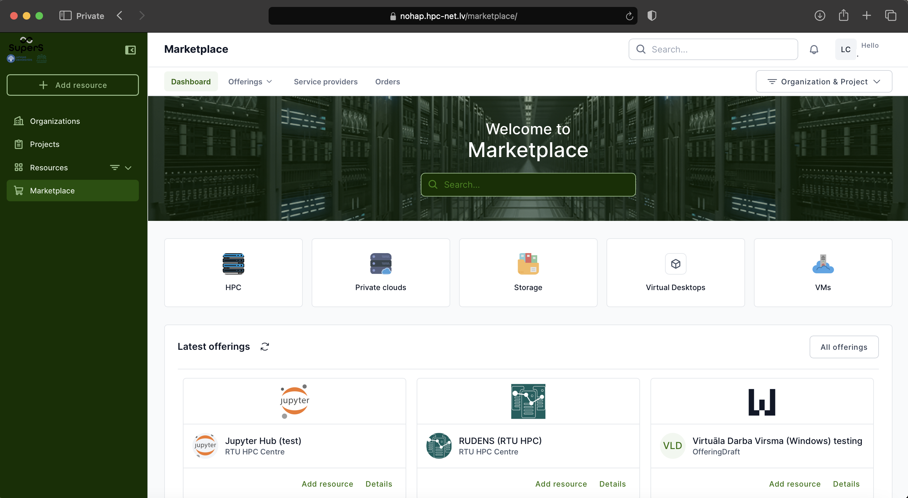

# WALDUR: Access the HPC Platform

The heart of the [National Open HPC platform](https://nohap.hpc-net.lv) is **WALDUR**, a user-friendly self-service portal for requesting and managing access to computing resources.

The built-in **Marketplace** offers a catalog of HPC services provided by Latvian academic institutions (currently RTU and LU), including:
- Virtual desktops  
- HPC clusters  
- Jupyter notebook environments  



---

## Who Can Access the Platform?

Access to HPC services is currently by **invitation only**. Users without an invitation can still log in and explore the portal, but with limited service availability.

**How to get invited:**

- **Research groups**, **course instructors**, or **individual students** working on research or thesis projects should contact the **RTU HPC center**.
- **Students enrolled in courses** that require HPC services should receive invitations from their course instructors.

---

## Supported Authentication Methods

Authentication is handled via GEANT MyAccessID, which supports:
- **EduGAIN** – Log in using your university credentials  
- **eIDAS** – Use your national electronic ID  

---

## Connect to the Self-Service Portal

Visit the HPC Platform: [https://nohap.hpc-net.lv](https://nohap.hpc-net.lv)

```{include} ./include/waldur_access.md
```
## Invite participants

```{include} ./include/waldur_invite.md
