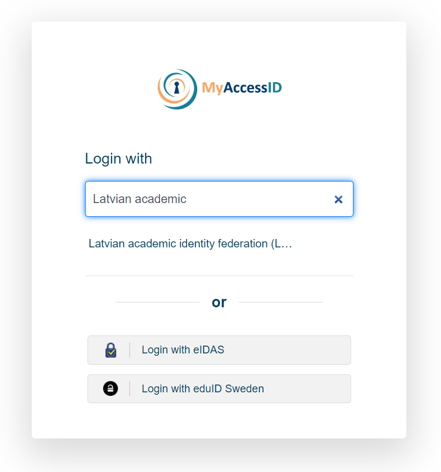

Please start by clicking on [Sign in with RTU HPC]

  
By selecting MyAccessID method, you should be able to authenticate with your university login details or eEIDAS.

  
In MyAccessID window under "Login with" search for your university's identity provider.  

  
In case of the Riga Technical University, select identity provider "Riga Technical University (Office 365)".

Similar to University of Latvia  

and Riga Stradiņš University  

You will be redirected to your organizations identity provider authorization portal, in this case RTU ORTUS.  Please follow all authentication steps begining with your login:

  
Later confirm authentication by scrolling down MyaccessID warning message:

  
After successful authentication you will be asked to confirm[ACCEPT] you name and email in Waldur system profile:

