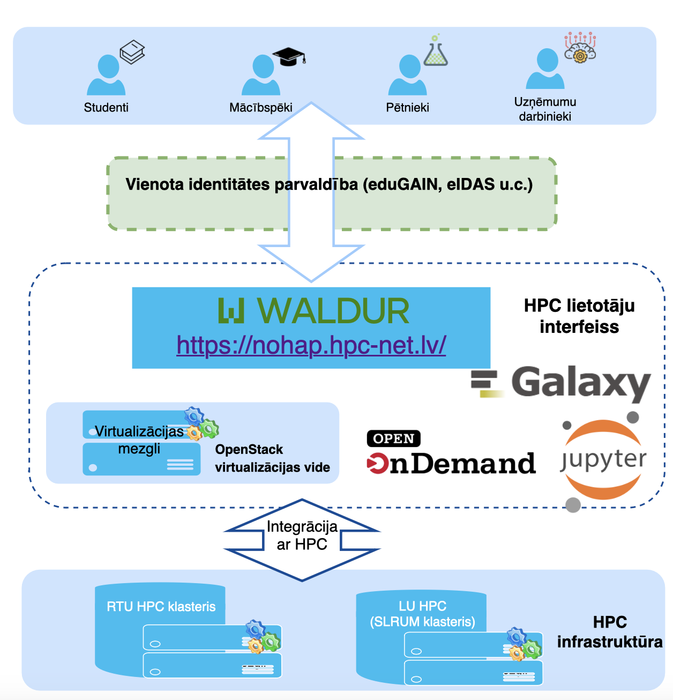

.. this is a comment, it is not rendered
   when adding new *.rst files, reference them here
   in this index.rst for them to be rendered and added to the
   table of contents

HPC Platform User Guide 
=======================

This page provides instructions for using different tools and interfaces available through the High-performance Computing (HPC) platform.

.. toctree::
   :maxdepth: 1

   01_waldur.md
   galaxy.md
   02_jupyter_hub.md
   hpc.md
   lti.md

The central element of the HPC platform is a user-friendly interface for reserving and accessing computing resources. The interface provides access to supercomputer and virtualization infrastructure (virtual classrooms), as well as HPC-enabled thematic web portals for data analysis and visualization.

  
