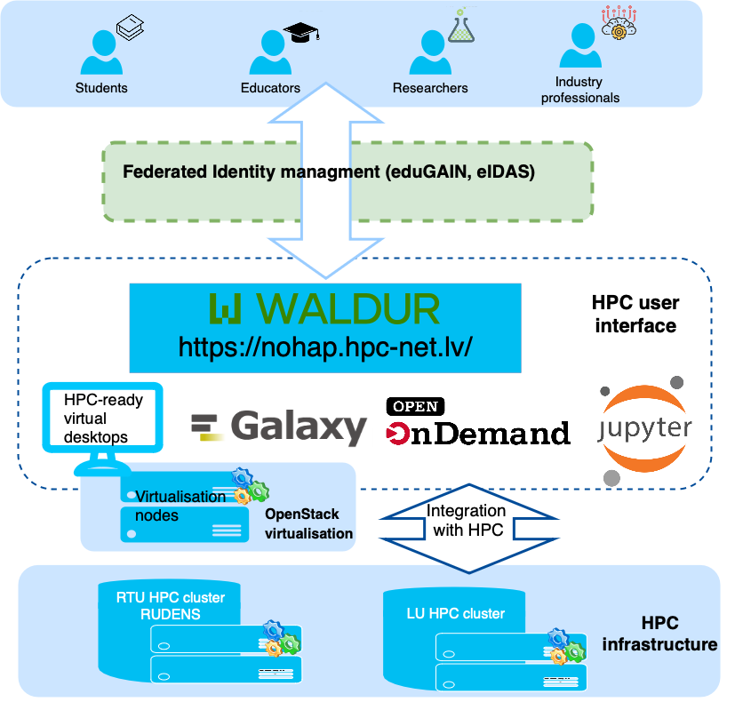

.. this is a comment, it is not rendered
   when adding new *.rst files, reference them here
   in this index.rst for them to be rendered and added to the
   table of contents

HPC Platform User Guide 
=======================

This page provides instructions for using different tools and interfaces available through the High-performance Computing (HPC) platform.

.. toctree::
   :maxdepth: 1

   hpc_platform.md
   01_waldur.md
   hpc.md
   galaxy.md
   02_jupyter_hub.md
   seqr.md
   lti.md
   learning_resources.md

The HPC platform provides students, educators, researchers, and industry professionals with a single point of access to virtual computing infrastructure to support learning and development of advanced digital skills.

  
Functional layers of the HPC platform:
**User Community**
Different user groups are welcome: students, educators, researchers, and industry professionals. Users can access the platform 24/7 from anywhere.
**Authentication**
We aim to implement single sign-on for all services provided by the platform. Federated identity management via GEANT Edugain and National electronic IDs allows anyone from the EU access to the platform. 
**User interface**
The user interface layer provides a set of tools like Open OnDemand, HPC-ready virtual desktops for user-friendly access to HPC, as well as HPC-enabled thematic web portals (Galaxy, Jupyter Hub, Seqr, and others) for data analysis and visualization. Most of the tools are web-based, meaning that the interaction with the supercomputer is possible without leaving the web browser; nevertheless, traditional access through SSH is still available. 
WALDUR plays a central role in this layer: a self-service portal for requesting and managing access to computing resources. The built-in Marketplace offers a catalog of HPC services provided by Latvian academic institutions. 
Each of the tools of the user interface layer is explained in more detail in subsections of this documentation page.
**Virtualization*
Although technically part of the hardware stack, virtualization in the context of the HPC platform acts as a gateway by providing pre-configured virtual machines. These VMs simplify access by offering familiar software environments (e.g., MATLAB) that are pre-integrated with the supercomputer.
*HPC hardware infrastructure*
The hardware layer of the platform consists of HPC clusters (supercomputers) hosted by Latvian academic institutions, providing the core computing and storage resources of the platform.
