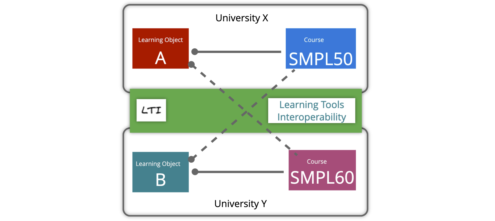
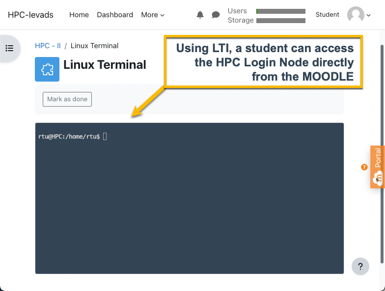
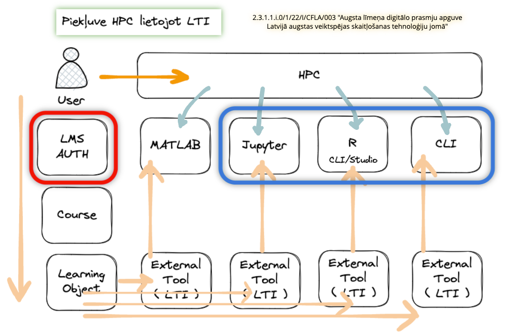
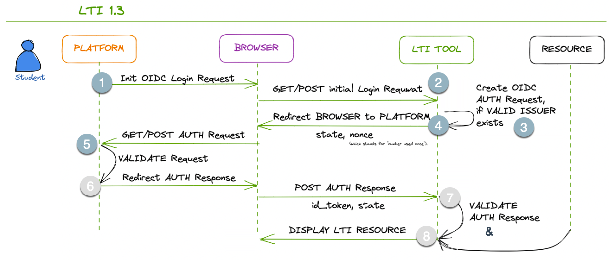
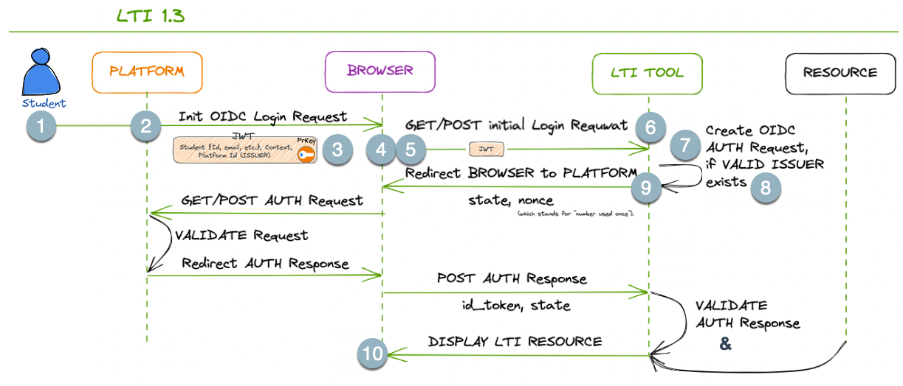
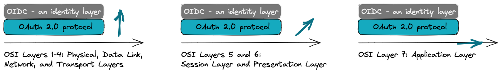
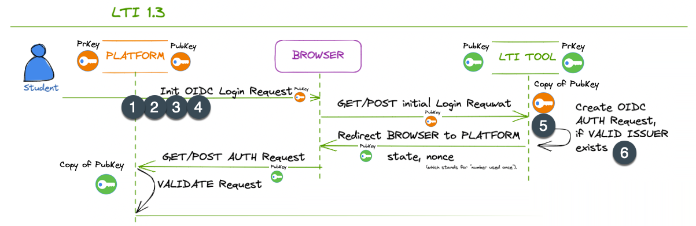

# Introduction to Learning Tools Interoperability (LTI) 

*For Instructional Designers creating content  
and Instructors teaching High-Performance Computing (HPC)*

## About LTI:
Learning Tools Interoperability (LTI) is a technology standard widely used in the education sector to enhance the interoperability and integration of various learning tools and systems. LTI enables seamless connectivity between learning management systems (LMS) and external learning tools/resources, allowing instructors and learners to access multiple educational resources and services within their LMS environment. This brief guide will provide an overview of LTI and its benefits for instructional designers.

### 1. What is LTI?
LTI, or Learning Tools Interoperability, is a standard protocol developed by the IMS Global Learning Consortium. It enables the integration of external learning tools, such as interactive modules, assessments, simulations, and more, into an existing learning management system. LTI establishes a secure and standardized way for individual learning content providers and platforms like Moodle, Canvas LMS, Sakai, Blackboard, etc., to communicate, ensuring seamless interoperability.

### 2. How does LTI work?
LTI relies on a simple yet powerful mechanism called "launching." When an instructor selects an external tool within their LMS, the LMS launches it in a separate WEB Browser Frame or Tab. For a result, please take a look at the screenshot above. LTI passes essential information, such as user identity and context, from the LMS to the tool, allowing it to provide personalized and contextualized learning experiences. This seamless integration eliminates the need for multiple logins or navigating between different platforms.

### 3. Benefits of LTI for Instructional Designers:
- Enhanced Tool Selection: LTI opens up a vast ecosystem of educational tools and resources that instructional designers can integrate into their courses. This flexibility allows for more varied and engaging learning experiences.
- Streamlined Workflow: LTI eliminates the need for manual data transfers or managing multiple platforms separately. Instructional designers can focus on designing effective content without worrying about technical implementation and integration into the learning ecosystem.
- Personalization and Contextualization: LTI enables transferring user data, such as roles, grades, and progress, between the LMS and external tools. Instructional designers can leverage this data to create personalized and adaptive learning experiences for learners.
- Scalability and Updates: LTI-compatible tools can be easily added or replaced within an LMS, providing scalability and the ability to adapt to changing instructional needs. When teaching-learning tools are updated, the changes are reflected seamlessly across courses using LTI integration.

### 4. LTI Integration Process:
To integrate an external tool using LTI, instructional designers typically follow these steps:
1. Obtain an LTI-compatible tool or content from a vendor or create one in-house.
2. Configure the LTI tool within the LMS by providing must-have information, such as the tool's launch URL, consumer key, and secret.
3. Test the integration to ensure the tool is launching correctly and receiving the necessary user data.
4. Collaborate with the tool provider to customize the tool's behaviour and appearance within the LMS environment.

### Conclusion:
Learning Tools Interoperability (LTI) empowers instructional designers by seamlessly integrating external tools and resources into learning management systems. By leveraging LTI, designers can enhance their courses with a wide range of educational resources while maintaining a streamlined workflow. LTI promotes personalization, contextualization, scalability, and the ability to meet evolving instructional needs. Embracing LTI opens doors to a world of possibilities for instructional designers to create engaging and compelling learning experiences.

## Challenges for LTI users

*Challenges for Instructional Designers Using LTI in High-Performance Computing Teaching*

When instructional designers use Learning Tools Interoperability (LTI) in teaching High-Performance Computing (HPC), they may encounter several challenges. Here are some common challenges:

1. Technical Compatibility: LTI relies on the compatibility between the learning management system (LMS) and the external HPC tools. Ensuring the HPC tools are LTI-compatible and can seamlessly integrate with the LMS may require technical expertise and coordination with tool providers.

2. Complex Configuration: High-Performance Computing often involves complex software installations and configurations. Integrating HPC tools with an LMS through LTI may require additional configuration steps, such as setting up secure connections, managing authentication mechanisms, and handling large-scale data transfers. Instructional designers may need IT or HPC specialists' assistance to navigate these complexities.

3. Data Security and Privacy: High-Performance Computing often deals with sensitive data, such as research or user information. Instructional designers must ensure that LTI integrations maintain data security and privacy standards. This includes encryption of data transfers, adherence to data protection regulations, and secure user authentication mechanisms.

4. User Authentication and Access Control: HPC systems typically require specific user access privileges and authentication mechanisms. Integrating HPC tools through LTI may require careful consideration of how user authentication and access control are managed within the LMS environment. Instructional designers must ensure that only authorized users can access the HPC resources and that appropriate access controls are in place.

5. Resource Availability and Scalability: HPC resources are often limited and highly demanded. Instructional designers must consider the scalability and availability of HPC tools when integrating them through LTI. Ensuring that the tools can handle multiple concurrent users, manage resource allocation efficiently, and accommodate varying levels of computational demand can be challenging.

6. Training and Support: Instructional designers and faculty may require training and support in using HPC tools integrated through LTI effectively. Providing comprehensive documentation, tutorials, and user support resources can help address any challenges and ensure a smooth user experience.

7. Keeping Pace with Technological Advances: High-Performance Computing rapidly evolves, and new tools and techniques are constantly emerging. Instructional designers using LTI for HPC teaching must stay updated with the latest advancements to provide learners with relevant and up-to-date resources.

Overcoming these challenges requires collaboration between instructional designers, IT professionals, HPC experts, and tool providers. By actively addressing these challenges, instructional designers can leverage LTI to enhance the teaching and learning experiences in High-Performance Computing.

## We use LTI version 1.3

### About LTI 1.3
 - **LTI 1.3 offers**: 
Improved security based on OAuth2 and JSON Web Tokens makes security updates safer and more accessible. 
Improved documentation and directions for implementation.
Since LTI 1.3 is built on LTI 1.1, it provides an easier upgrade path, allowing for more straightforward adoption and requiring a smaller learning curve. 

- **LTI Advantage**:
LTI 1.3 improves existing services by allowing new extensions to be layered on the existing launch mechanism. Currently, there are three extensions available in LTI 1.3 and more planned. This bundle of extensions evolves outside the LTI specification and is called LTI Advantage.

- **Deep Linking Service**, which makes it easier to provide links to specific content. This was named a content item previously.

- **Name and Role Provisioning** makes obtaining a list of course participants and roles easier and sends defined information to the learning tools. This extension was also known as *membership service* previously.
  
- **Assignment and Grade Service** makes passing grade information between the tool and the Learning Platform easier. This extension was named the outcome service previously.

### How systems communicate in LTI 1.3

#### Initial view

In LTI 1.3, the initial part(stage) of the communication protocol between the PLATFORM (LTI Tool Consumer) and the LTI TOOL involves the platform requesting validation from the LTI Tool and the Tool performing LTI validation on the Platform side. Here are the steps involved:

1. The PLATFORM (LTI TOOL Consumer) initiates the communication by sending an HTTP POST request to the LTI TOOL's platform registration endpoint. This request includes the necessary information to establish the connection, such as the platform's client ID and the intended scope.

2. The LTI TOOL receives the request and validates the authenticity and integrity of the incoming request. It verifies that the request comes from a trusted platform using established authentication mechanisms.

3. If the request is valid, the LTI TOOL performs LTI validation on the PLATFORM side. It verifies that the PLATFORM is an approved and reasonable (valid) LTI Tool Consumer by checking the platform's client ID and other relevant credentials.

4. Once the LTI validation is successfully performed, the LTI TOOL sends a response back to the PLATFORM, indicating that the platform is authorized to communicate with the tool.

5. The platform receives the response from the LTI TOOL and acknowledges the successful validation.

At this point, the PLATFORM has been validated by the LTI TOOL, establishing the trust necessary for further communication. Following this initial validation, the subsequent steps of the communication protocol can proceed, including the launch process where the PLATFORM sends the LTI Launch Request to the LTI TOOL, as described in the following explanation.

This initial part of the communication protocol in LTI 1.3 ensures that the platform and tool authenticate and validate each other before proceeding with the exchange of information.

#### Another view

Here are the steps of the communication process in LTI 1.3 following the initial stage:

1. The user initiates an action to launch an LTI TOOL from the platform's interface.
2. The PLATFORM generates an LTI Launch Request:
   - a secure token (JWT) containing information about the user,
   - context, and
   - other necessary parameters.
3. The platform constructs a launch URL for the LTI TOOL, which includes the LTI Launch Request as a parameter. This URL may consist of additional parameters as required.
4. The platform redirects the browser to the launch URL, passing the LTI Launch Request as a parameter.
5. The BROWSER "*makes a request*" to the LTI TOOLS's endpoint, including the LTI Launch Request as a parameter. This request is typically an HTTP POST request.
6. The LTI TOOL receives the launch request and validates the authenticity and integrity of the LTI Launch Request. It verifies the signature using the PLATFORM's public key and ensures the request hasn't been tampered with.
7. If the LTI Launch Request is valid, the LTI TOOL extracts the necessary information from the request payload to authenticate the user and set up the tool's environment accordingly.
8. The LTI TOOL prepares a response, which includes any additional information required by the platform, such as grades or outcomes.
9. The LTI TOOL sends the response back to the platform, typically as an HTTP POST request, including the required data.
10. The PLATFORM receives the response from the LTI TOOL, processes the data as needed, and presents the appropriate information to the user within its interface.

In the last step, we skip the symmetrical validation from the PLATFOM's perspective and instructional business logic on the PLATFORM and TOOL sides.

In LTI 1.3, the PLATFORM, BROWSER, and LTI TOOL communication rely on *secure JWTs* for passing information and ensuring data integrity. This token (JWT) is signed using PLATFORM's Private Key (PrKey). 

The launch process involves redirecting the browser to the LTI Tool's endpoint with the necessary information encapsulated within the JWT.  The subsequent communication occurs through HTTP requests.

### What is JWT for?

*JWT - JSON Web Token*  
*JSON - JavaScript Object Notation*

In summary, the JWTs (containing the provided objects) are typically used in communication from the PLATFORM (LTI Consumer) to the LTI TOOL as part of the launch process, allowing the LTI TOOL to receive user data, context and permissions securely.

### On secure and insecure JWTs

The terms "secure JWT" and "insecure JWT" are not standard terminology, but they can be used to describe JWTs based on their characteristics and how they are used in a specific context. Let's explore the difference between these two types of JWTs:

1. Secure JWT:
   - A secure JWT refers to a JSON Web Token that has been appropriately handled and implemented following security best practices. This includes proper validation, verification, and protection against common JWT vulnerabilities.

   - Characteristics of a secure JWT:
     - It is adequately signed using a *strong* cryptographic algorithm (e.g., RS256) to ensure data integrity.
     - The signing key used to generate the JWT is adequately protected and kept confidential.
     - The token _payload contains only necessary information and does not expose sensitive data_.
     - The token includes an appropriate expiration (exp) claim, limiting the token's validity period.
     - The token is used within a secure and trusted communication channel.
     - It is validated carefully on the receiving end to prevent token tampering and misuse.

2. Insecure JWT:
   - An insecure JWT, on the other hand, refers to a JSON Web Token that lacks proper security measures or is used inappropriately, leaving it vulnerable to attacks or misuse.

   - Characteristics of an insecure JWT:
     - It may use a weak cryptographic algorithm for signing, such as an unsuitable HMAC algorithm.
     - The token payload may contain sensitive information or user data in a readable format without proper encryption or obfuscation.
     - The token might have an extended validity period or lacks an expiration claim, leading to an increased risk of unauthorized access if intercepted.
     - The token is used in unsecured communication channels, making it susceptible to interception and tampering.
     - It is not carefully validated on the receiving end, allowing for token spoofing or replay attacks.

In summary, the main difference between a "secure JWT" and an "insecure JWT" lies in the level of security measures implemented in their creation, handling, and validation. A secure JWT follows best practices to ensure data integrity, confidentiality, and protection against common vulnerabilities. At the same time, an insecure JWT lacks these essential security features, potentially putting sensitive data and applications at risk.

### OIDC - what is it for?

In the context of OIDC being an identity layer built on top of the OAuth 2.0 protocol, it's helpful to understand the layering concept in this model.

In this model, the layers can be conceptualized as follows:

1. Bottom Layer: HTTP and Transport Layer
   - This foundational layer handles the essential communication between client-server applications using the HTTP protocol. It includes the transmission of requests and responses over the network.

2. OAuth 2.0 Layer
   - OAuth 2.0 is an authorization framework that allows applications to obtain limited access to user resources on behalf of the user. It operates above the HTTP layer and provides a standardized way for clients to request and obtain access tokens from authorization servers. The OAuth 2.0 layer handles the authorization flow and token management.

3. OIDC Layer
   - OpenID Connect (OIDC) operates as an identity layer built on top of OAuth 2.0. It introduces additional features to OAuth 2.0 to facilitate user authentication and identity information exchange. OIDC extends the capabilities of OAuth 2.0 by adding an ID token, which contains user identity information, and standardized endpoints for user authentication and authorization. The OIDC layer builds upon the OAuth 2.0 layer and provides identity-related functionality.

In this layering model, the HTTP and Transport Layer forms the foundation, followed by the OAuth 2.0 layer for authorization and the OIDC layer for identity and authentication. The layers build upon each other, adding specific functionality to enable secure and standardized communication, authorization, and identity management between client applications and service providers.

The standard OSI (Open Systems Interconnection) model is a conceptual framework that defines seven layers to understand and describe the functions and interactions of networking protocols. While the OSI model primarily focuses on network communication, it can be related to the layering concept in OAuth 2.0 and OIDC in the following way:

1. OSI Layer 7: Application Layer
   - This layer in the OSI model corresponds to the highest layer, which is responsible for providing services directly to the end user. In the context of OIDC and OAuth 2.0, the OIDC layer can be considered as a part of the Application Layer, as it deals with identity, authentication, and authorization.

2. OSI Layers 5 and 6: Session Layer and Presentation Layer
   - The functions of these layers in the OSI model, such as establishing and managing sessions and data presentation, are not directly analogous to the OAuth 2.0 and OIDC layers. These layers in the OSI model deal with different aspects of network communication and data formatting.

3. OSI Layers 1-4: Physical, Data Link, Network, and Transport Layers
   - These lower layers in the OSI model handle the physical transmission, addressing, routing, and reliable data transport. While these layers are crucial for network communication, they are not directly tied to the functionality provided by OAuth 2.0 and OIDC.

It's important to note that the OSI model and the layering concept in OAuth 2.0 and OIDC serve different purposes. The OSI model provides a general framework to understand network protocols and their functions. At the same time, the layering in OAuth 2.0 and OIDC specifically focuses on authorization, identity, and authentication in the context of client-server applications.

#### About Private and Public Encryption keys

In the communication process between the *Platform* and the *LTI Tool* in LTI 1.3, private and public encryption keys are used for secure communication and authentication. 

Here's how they are involved:

1. Platform Intention to Communicate:
   - When the platform (LTI Tool Consumer) intends to communicate with an LTI Tool, it generates a key pair consisting of a private key and a corresponding public key.

2. Platform Registration:
   - The platform registers itself with the LTI Tool, providing its public key as part of the registration process. This allows the LTI Tool to establish trust with the platform and verify its identity.

3. Launch Request:
   - The platform initiates the launch process and includes its public key as metadata in the LTI Launch Request. This public key is used by the LTI Tool to verify the authenticity and integrity of subsequent messages from the platform.

4. JWT Signing:
   - As part of the launch process, the platform signs the LTI Launch Request using its private key. This signature ensures the integrity and authenticity of the request. The LTI Tool can verify this signature using the platform's public key.

5. Request Verification on the LTI Tool Side:
   - The LTI Tool receives the LTI Launch Request and extracts the platform's public key from the metadata. It uses this public key to verify the signature of the request, ensuring that the platform's private key has signed it.

6. Establishing Trust:
   - Once the LTI Tool successfully verifies the request's signature using the platform's public key, it establishes trust with the platform. This trust enables further secure communication and exchange of information between the platform and the LTI Tool.

In summary, private and public encryption keys are used in the communication process to establish trust, verify the authenticity of messages, and ensure secure communication between the platform and the LTI Tool. The platform's private key is used to sign the messages, while the LTI Tool uses the platform's public key to verify the signatures and establish trust with the platform.

*To be continued...*
